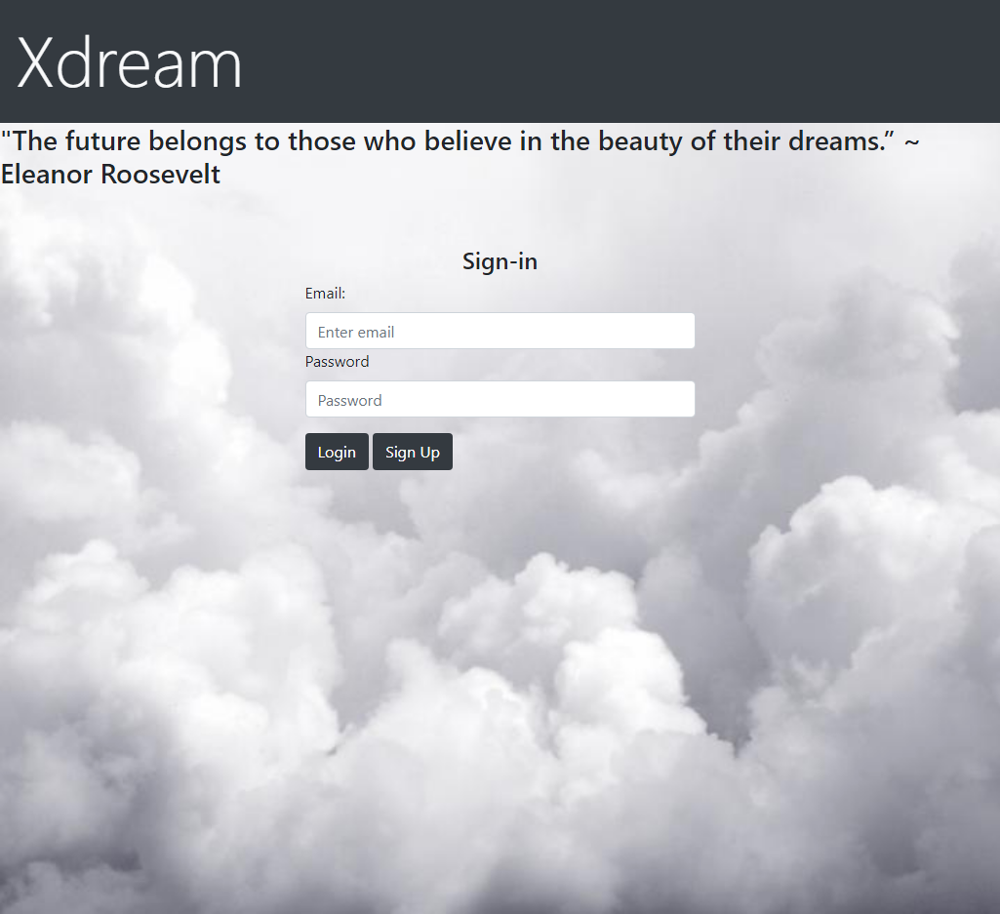

# [Xdream Dream Journal](https://github.com/llacourciere/Xdream)

### Table of Contents

1. [Description](#description)
2. [Built With](#built-with)
3. [Installation](#installation)
4. [Usage](#usage)
5. [Contributing](#contributing)
6. [Acknowledgments](#acknowledgments)

## Description

This is an online dream journal that allows a user to create public and private dream journal entries. Public dreams are included in the dreamscape forum which allows other users to see and comment on dreams.

### Built With

* JavaScript
* HTML
* CSS
* Bootstrap
* Node.js
* Handlebars

## Installation

To install the application locally, clone this repo then type 
~~~ 
npm i 
~~~ 
into the command line to download all dependancies. To start running the server locally, type 
~~~ 
npm start 
~~~ 
into the command line. 

(<a href="#top">back to top</a>)

## Usage

To use the application, create a user profile with a username, email address, and password, then login to the site. Dream journal entries can be created on the Dashboard page, along with a category tag. Select the checkbox to make a dream public. Public dreams can be viewed on the Dreamscape Forum page. Users can comment on individual dreams by selecting the dream to view it individually.

## Contributing

This repo was created by the following GitHub users: 
* [llacourciere](https://github.com/llacourciere)
* [apatheticjedi](https://github.com/apatheticjedi)
* [Rosepetal2022](https://github.com/Rosepetal2022)
* [frieskevin](https://github.com/frieskevin)

(<a href="#top">back to top</a>)

## Acknowledgments

* [AOS-Animate on scroll library](https://github.com/michalsnik/aos)
* bcryptjs npm
* connect-session-sequelize npm
* dotenv npm
* express npm
* exress-session npm
* mysql2 npm
* sequelize npm

## License

[MIT License](https://spdx.org/licenses/MIT.html)

(<a href="#top">back to top</a>)

